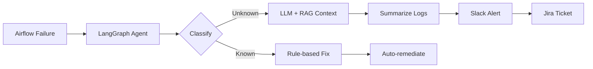

<!-- Unique portfolio — built from resume, not a template -->

<h1 align="left">Varun Billuri</h1>

<p align="left">
  <strong>AI/ML Engineer</strong> · Agentic systems · Multilingual voice AI · MLOps<br/>
  Building production AI that survives real pipelines, real languages, and real on-call.
</p>

<p align="left">
  <a href="mailto:varunreddy.billuri@gmail.com">varunreddy.billuri@gmail.com</a> ·
  <a href="https://linkedin.com/in/billurivarun">LinkedIn</a> ·
  <a href="https://github.com/varunbiluri">GitHub</a> ·
  Andhra Pradesh, India
</p>

---

## Impact at a glance

| | |
|:--|:--|
| **~60% MTTR reduction** | Agentic incident response at ThoughtSpot — auto-triage, Slack routing, Jira creation |
| **Petabyte-scale ETL** | Orchestration across AWS & GCP feeding ML training datasets |
| **Healthcare multilingual AI** | Tigrinya, Wolof, Bambara, Arabic dialects — STT/TTS/LLM eval at Worldish |
| **Rank 1973 / 200k+** | CodeKaze coding competition |
| **Published research** | Medical record digitization with OCR — IJARCCE |

---

## What I build

```
┌─────────────────────────────────────────────────────────────────┐
│  AGENTIC RELIABILITY          MULTILINGUAL AI          MLOps    │
│  LangGraph · RAG · Airflow    STT · TTS · LLM eval    Fine-tune │
│  Anomaly detection · MTTR     Low-resource languages  Deploy    │
└─────────────────────────────────────────────────────────────────┘
```

I work at the intersection of **GenAI systems engineering** and **production ML** — from LangGraph agents that remediate Airflow failures, to real-time voice AI for healthcare in under-resourced languages.

---

## Experience

### [Worldish](https://worldish.se) · Software Engineer
`Dec 2025 — Present` · Multilingual healthcare AI

- Lead AI/ML feature development for **production healthcare conversational systems**
- Built **MLOps pipelines** for rare & low-resource language fine-tuning — dataset prep → train → eval → deploy
- Engineered **Arabic dialect evaluation platform** integrating LLM prompting, STT, and TTS across multiple providers
- Redesigned core AI pipelines for **multilingual orchestration**, inference scalability, and cross-service reliability
- Benchmarked LLM/STT/TTS providers on **accuracy, latency, and conversational quality** for real-time interactions

### [ThoughtSpot](https://www.thoughtspot.com) · Member of Technical Staff 2
`Jan 2025 — Dec 2025` · Agentic AI & data platform reliability

- Built **agentic AI framework** (LangChain + LangGraph) for Airflow pipeline failure triage — rule-based logic + LLM classification, Slack alerts, safe auto-remediation
- Deployed **LLM log summarization** (LangChain + Ollama) converting raw Airflow logs into developer-facing insights
- Shipped **AI anomaly detection** on ETL metadata (DAG states, XComs, SIGTERM patterns) with PostgreSQL dashboards for SRE teams
- Cut **MTTR by ~60%** with ML classifiers auto-routing alerts to Slack and auto-creating Jira tickets
- Extended orchestration for **petabyte-scale ETL** across AWS & GCP; modularized pipelines for ML training datasets
- Fine-tuned **Azure OpenAI models** for internal workflows — training loops, dataset preprocessing, eval scripts (PyTorch)

### ThoughtSpot · AI/ML Intern
`Jun 2024 — Dec 2024`

- Built backend services & data pipelines for pricing/metrics datasets enabling downstream ML workflows
- Prototyped **RAG system** (LangChain + Haystack) with vector stores for contextual Q&A on pricing data
- Experimented with agentic workflows combining retrieval, summarization, and alerting

---

## Signature systems

### Agentic pipeline reliability
> LangGraph agents for autonomous triage, log summarization, root-cause analysis, and remediation



- RAG over historical incidents for grounded reasoning
- Guardrails for safe action execution in production
- **Result:** ~60% MTTR reduction, standardized on-call workflows

---

### VisioVoice · Multimodal accessibility AI
> Blind-first voice interaction with one-shot vision analysis and conversational memory

| Layer | Stack |
|:------|:------|
| Vision | Azure OpenAI Vision → structured JSON (no re-send) |
| Voice | Azure Speech STT/TTS, continuous conversational loops |
| Backend | FastAPI + React |
| Design | Grounded architecture — deterministic reasoning from scene JSON |

Real-time hazard-aware narration and spatial scene understanding for accessibility-focused interactions.

---

### MediScan · Medical record digitization
> OCR + LSTM pipeline for precision medical record digitization

- Google OCR with advanced preprocessing
- LSTM models + terminology correction
- Flask interface for image-to-text conversion
- **Published:** [IJARCCE DOI: 10.17148/IJARCCE.2024.134141](https://doi.org/10.17148/IJARCCE.2024.134141)

---

## Open source & engineering work

| Project | What it demonstrates |
|:--------|:---------------------|
| [fastapi-tool-agent-clean](https://github.com/varunbiluri/fastapi-tool-agent-clean) | Production LLM agent — FastAPI, Azure OpenAI, Key Vault, CI/CD |
| [indian-job-search-agents](https://github.com/varunbiluri/indian-job-search-agents) | Multi-agent orchestration with web retrieval |
| [coda](https://github.com/varunbiluri/coda) | Multi-agent code orchestration & testing workflows |
| [airflow-spinnaker](https://github.com/varunbiluri/airflow-spinnaker) | Airflow + Spinnaker on Azure Kubernetes |
| [aicp-automated](https://github.com/varunbiluri/aicp-automated) | Autonomous GenAI content pipeline on Azure |
| [recomendation-system](https://github.com/varunbiluri/recomendation-system) | IR & recommendation system implementation |

---

## Stack

**Languages** · Python · Java · SQL · JavaScript · C

**GenAI & ML** · LangChain · LangGraph · PyTorch · Hugging Face · RAG · LLM fine-tuning · Speech AI (STT/TTS) · Multilingual NLP · BERT · TensorFlow

**Data & Platform** · Airflow · Snowflake · PostgreSQL · FastAPI · Django · Flask · React · MongoDB

**Cloud & MLOps** · AWS · Azure · GCP · MLflow · Grafana · Prometheus · Ollama · Docker · Kubernetes

---

## Education & credentials

**B.Tech — Computer Science & Business Systems** · JNTU Anantapur · GPA 7.6/10 · `2020 — 2024`

| Certification | Issuer |
|:--------------|:-------|
| AWS Certified Data Engineer – Associate (DEA-C01) | AWS |
| Machine Learning Specialization | DeepLearning.AI & Stanford |
| Generative AI with Large Language Models | — |
| Java Programming & SE Fundamentals | Duke University |
| Elite Certificate in IoT | NPTEL |

---

## Publication

> **Digitization of Medical Records using OCR**  
> B. Varun Kumar Reddy, G. Kishor Kumar, et al.  
> *International Journal of Advanced Research in Computer and Communication Engineering*  
> [DOI: 10.17148/IJARCCE.2024.134141](https://doi.org/10.17148/IJARCCE.2024.134141)

---

## Beyond code

- Led university basketball team to **South Zone league finals**
- **Class Representative**, CSE & BS Department · Core member, Tech Community
- Active in hackathons — NLP & AI prototypes

---

<p align="left">
  <sub>
    Currently at <strong>Worldish</strong> building multilingual healthcare AI ·
    Previously shipped agentic reliability systems at <strong>ThoughtSpot</strong>
  </sub>
</p>

<p align="left">
  <a href="mailto:varunreddy.billuri@gmail.com"><strong>Get in touch →</strong></a>
</p>
