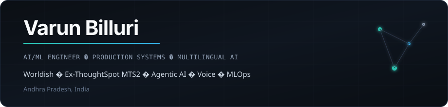
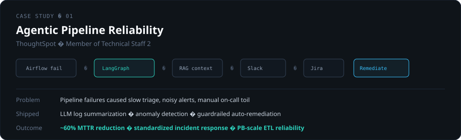
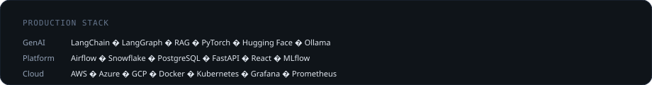

 

  <a href="mailto:varunreddy.billuri@gmail.com">Email</a>&nbsp;&nbsp;·&nbsp;&nbsp;
  <a href="https://linkedin.com/in/billurivarun">LinkedIn</a>&nbsp;&nbsp;·&nbsp;&nbsp;
  <a href="https://github.com/varunbiluri">GitHub</a>

 

 

<table>
<tr>
<td width="50%" valign="top">

</td>
<td width="50%" valign="top">

</td>
</tr>
</table>

 

 

<table>
<tr>
<td width="33%" valign="top">

**Now**  
Software Engineer @ Worldish  
Multilingual healthcare AI

</td>
<td width="33%" valign="top">

**Previously**  
MTS2 @ ThoughtSpot  
Agentic reliability · PB ETL

</td>
<td width="33%" valign="top">

**Research**  
[Medical OCR paper](https://doi.org/10.17148/IJARCCE.2024.134141)  
AWS DEA-C01 · DeepLearning.AI ML

</td>
</tr>
</table>

 

<strong>Selected open-source work</strong>

 

| Repo | Focus |
|:-----|:------|
| [fastapi-tool-agent-clean](https://github.com/varunbiluri/fastapi-tool-agent-clean) | Production LLM agent · Azure OpenAI · CI/CD |
| [airflow-spinnaker](https://github.com/varunbiluri/airflow-spinnaker) | Airflow orchestration on AKS |
| [indian-job-search-agents](https://github.com/varunbiluri/indian-job-search-agents) | Multi-agent retrieval system |
| [coda](https://github.com/varunbiluri/coda) | Multi-agent code orchestration |
| [aicp-automated](https://github.com/varunbiluri/aicp-automated) | GenAI content pipeline on Azure |

 

  Open to ML systems, agentic AI, and multilingual voice roles. 
  <a href="mailto:varunreddy.billuri@gmail.com"><strong>varunreddy.billuri@gmail.com</strong></a>

